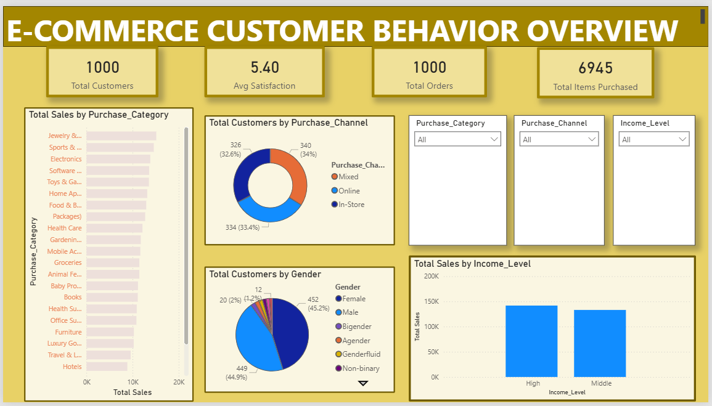
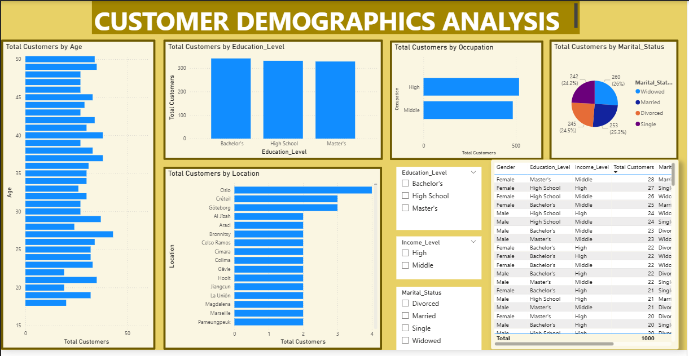
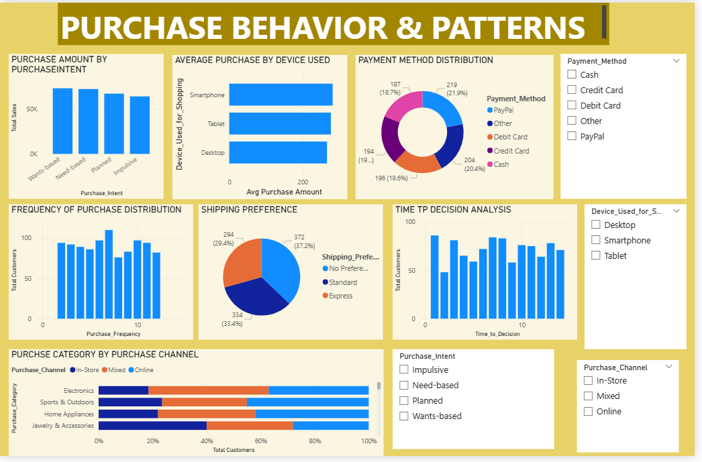
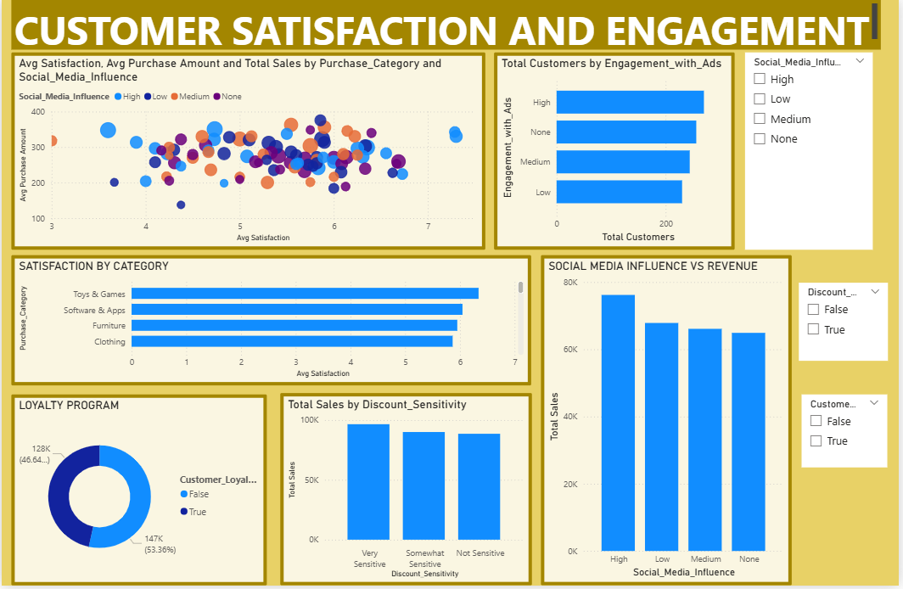

# 📊 E-Commerce Customer Purchase Behavior Analysis

## 🔍 Project Overview
An interactive Power BI dashboard analyzing 1,000+ e-commerce customer records
to uncover purchasing patterns, customer demographics, and satisfaction trends.

## 📁 Dashboard Structure
| Page | Title | Description |
|------|-------|-------------|
| 1 | Business Overview | KPIs — Total Customers, Orders, Satisfaction Score |
| 2 | Customer Demographics | Age, Gender, Education, Location, Marital Status |
| 3 | Purchase Behavior & Patterns | Intent, Device, Payment, Shipping, Decision Time |
| 4 | Satisfaction & Engagement | Loyalty, Discounts, Ad Engagement, Social Media |

## 🔑 Key Insights
- Middle-income customers are the highest revenue contributors
- Smartphones are the dominant shopping device
- Higher ad engagement correlates with increased revenue
- Loyal customers show more consistent purchase behavior

## 🛠 Tools Used
- Power BI Desktop
- Power Query (Data Cleaning & Transformation)
- DAX (Measures & KPIs)
- Data Modeling & Business Storytelling

## 📸 Dashboard Preview
### Business Overview

### Customer Demographics

### Purchase Behavior

### Satisfaction & Engagement

## 📌 Dataset
Dataset sourced from [Kaggle](https://www.kaggle.com) —
E-Commerce Customer Purchase Behavior Dataset.
